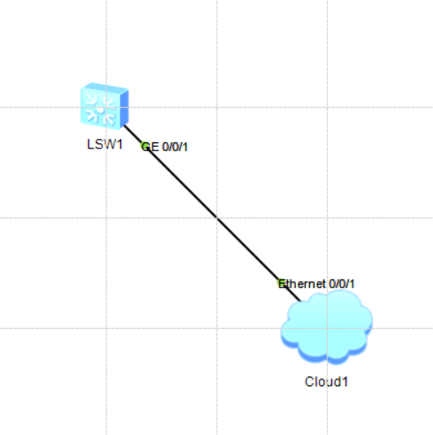

# ICT战队-第2次笔记

[toc]

<font color=#999AAA>江老师开场白：
组网：smart link
物理允许环路，工作时不允许
某一链路断开，不会影响其他的通信</font>

## Huawei命令行操作基础

```shell
# todo 交换机下配置管理ip
[Huawei]int vlan 1
[Huawei-Vlanif1]ip add 192.168.56.250 24
[Huawei-Vlanif1]undo shutdown

# todo 注释
[Huawei]description something
[Huawei]undo description

# todo 查看历史命令
[Huawei]display history-command历史记录命令

# todo 使用中文
<Huawei>language-mode Chinese 
Change language mode, confirm? [Y/N] y
Sep 20 2021 23:44:03-08:00 Huawei %%01CMD/4/LAN_MODE(l)[0]:The user chose Y when
 deciding whether to change the language mode.
提示：改变语言模式成功。
<Huawei>

# todo 查看设备的配置文件和操作系统
<Huawei>dir
Directory of flash:/

  Idx  Attr     Size(Byte)  Date        Time       FileName 
    0  drw-              -  Aug 06 2015 21:26:42   src
    1  drw-              -  Sep 19 2021 10:16:17   compatible

32,004 KB total (31,972 KB free)

# todo 关闭消息信息
[Huawei]un in en
[Huawei]undo terminal monitor
```

1)交换机没有0/0/0只有0/0/1
2)易失、非易失存储器->内存、硬盘
3)开机重装操作系统(操作系统是操作系统，配置文件是配置文件(开机配置、当前配置))

```shell
# todo 查看配置信息
display version  # 版本信息
display current-configuration  # 当前配置
display saved-configuration  # 保存配置
display current-configuration configuration XXX  # 管理员配置生效内容
display current-configuration configuration vlan  # vlan相关配置
display current-configuration | begin  # 管道输出指定内容
display current-configuration | b vty 0 4  # 管道输出
display current-configuration | include sysname  # sysname相关配置
display ip interface brief  接口ip状态配置信息，二层接口信息
display ip int brief  接口ip状态配置信息，接口三层信息
display interfaces g0/0/1  接口当前流量
```

1)推测设备环路：广播包1%+
2)Physical端口，Protocol协议；*down被管理员关掉的

|  设备  | 端口  | 协议 | 说明                                                         |
| :----: | :---: | :--: | ------------------------------------------------------------ |
| 交换机 | down  | down | 1.没有物理连接，2.(error disable)根防护，先shutdown再undo shutdown |
| 交换机 | *down | down | 管理员down，接口下undo shutdown                              |
| 路由器 |  up   | down | 1.没有物理连接，2.串行线路时钟频率不匹配，3.PPP协商失败      |

| 用户级别 | 允许使用的命令级 | 进入系统试图 | 保存配置文件 |
| :------: | :--------------: | :----------: | :----------: |
|    0     |      访问级      |     不能     |     不能     |
|    1     |      监控级      |      能      |     不能     |
|    2     |      系统级      |      能      |      能      |
|   3-15   |      管理级      |      能      |      能      |

### **实验一：Telnet远程登陆配置**

- Step1.网络拓扑



- Step1.5配置云

绑定信息：1.UDP、2.VirtualBox······IP: 192.168.56.1
端口类型：Ethernet
双向通道：√

- Step2.配置交换机

```shell
# todo 添加IP，此后主机可以ping通
<Huawei>sys
Enter system view, return user view with Ctrl+Z.
[Huawei]interface vlan 1
[Huawei-Vlanif1]ip address 192.168.56.250 24
[Huawei-Vlanif1]undo shutdown 
[Huawei-Vlanif1]

# todo 开启telnet服务
[Huawei]telnet server enbale  # 开启远程登录

# todo 配置虚拟接口
[Huawei]user-interface vty 0 4  # 同时进入5条虚链路配置
[Huawei-ui-vty0-4]user privilege level 15  # 设置用户级别为3
[Huawei-ui-vty0-4]protocol inbound telnet  # 设置允许telnet服务接入（默认允许所有）
[Huawei-ui-vty0-4]authentication-mode aaa  # 基本本地用户认证
[Huawei-ui-vty0-4]authentication-mode none  # 不认证
[Huawei-ui-vty0-4]authentication-mode password  # 基于vty线路下密码认证

# todo 线路下设置密码配合基于密码认证，即password
[Huawei-ui-vty0-4]set authentication password cipher huawei  # 设置线路下密码
[Huawei-ui-vty0-4]user privilege level 15  # 设线路下认证权限

# todo 创建认证用户，即aaa
[Huawei]aaa  # 进入aaa模式
[Huawei-aaa]local-user admin password cipher huawei  # 创建damin用户，设置密码
[Huawei-aaa]local-user admin service-type telnet  # 允许使用telnet服务
[Huawei-aaa]local-user admin privilege level 15  # 设置用户级别为15
```

- Step3.然后在SecureCRT使用Telnet远程登录

>- **问题**：为什么会down
>- **答**：(以后再说)

### **实验二：ssh配置**

telnet明文，ssh加密
数据对称加密：加密解密密钥一样
数据非对称加密：公钥加密之后的密文只有私钥能解密

- Step 0.网络拓扑(同上，略)

- Step 1.配置交换机

```shell
# todo 创建认证密钥对
[Huawei]rsa local-key-pair create
The key name will be: Huawei_Host
The range of public key size is (512 ~ 2048). 
NOTES: If the key modulus is greater than 512, 
       it will take a few minutes.
Input the bits in the modulus[default = 512]:
Generating keys...
..........++++++++++++
.............++++++++++++
.................++++++++
..++++++++

[Huawei]

# todo 配置虚链路
[Huawei]user-interface vty 0 4  # 同时进入5条虚链路进行配置
[Huawei-ui-vty0-4]user privilege level 15  # 设置用户级别为15
[Huawei-ui-vty0-4]authentication-mode aaa  # 基于本地用户认证
[Huawei-ui-vty0-4]protocol inbound ssh  # 设置允许ssh服务接入
[Huawei-ui-vty0-4]

# todo 创建ssh登录用户，切换与ssh登录权限
[Huawei]ssh user admin service-type stelnet  # 创建ssh用户
Info: Succeeded in adding a new SSH user.
[Huawei]ssh user admin authentication-type password  # 设置ssh验证方式

[Huawei]aaa  # 进入aaa模式
[Huawei-aaa]local-user admin password cipher huawei  # 创建用户admin并设置密码
[Huawei-aaa]local-user admin service-type ssh  # 允许使用ssh服务
[Huawei-aaa]local-user admin privilege level 15  # 设置用户级别为15
[Huawei-aaa]q
[Huawei]stelnet server enable  # 开启ssh服务
Info: Succeeded in starting the Stelnet server.
[Huawei]
```

开启了ssh服务就不能再使用telnet服务
而且，ssh服务只能使用aaa模式登录

- Step2.然后在SecureCRT使用ssh远程登录

- **SecureCRT**
  ssh要(不要)保存公钥

## Huawei网络设备文件管理

- **网络设备文件管理**：

```shell
# todo 1. 文件操作
<Huawei>dir /all  # 显示目录中的文件和子目录列表
<Huawei>mkdir [filename  # 创建目录
<Huawei>rmdir [filename  # 删除目录
<Huawei>more [filename  # 显示文件内容
<Huawei>copy [src-filename [des-filenmae  # 拷贝文件
<Huawei>move [src-filename [des-filenmae  # 移动文件
<Huawei>rename [old-name [new-name  # 重命名文件
<Huawei>delete filename  # 删除文件
<Huawei>undelete filename  # 恢复删除的文件
# <Huawei>fixdisk drive  # 修复文件系统异常的存储器
# <Huawei>format drive  # 格式化存储器

# todo 2. 配置文件操作
<Huawei>save  # 保存配置文件
<Huawei>reset saved-configuration  # 擦除配置文件
<Huawei>startup saved-configuration test  # 设置下次开机配置文件

# todo 3. 配置文件显示与维护
<Huawei>display saved-configuration  # 查看保存的配置文件
<Huawei>display startup  # 显示当前配置文件
<Huawei>display current-configuration # 显示当前配置文件
<Huawei>display current-configuration configuration aaa  # 查看指定内容
<Huawei>display this  # 查看当前视图下生效的配置

# todo 4. 指定下次启动加载的应用程序
<Huawei>startup system-software [iog-image  # 指定下次启动加载的应用程序
<Huawei>display boot-loader  # 显示下次启动加载的应用程序

# todo 5.重启系统
<SV3>reboot  # 重启
<Huawei>reboot fast  # 快速重启
<SV3>schedule reboot at 22:47  # 定时重启
<SV3>schedule reboot delay 00:01  # 等待重启
<SV3>display schedule reboot  # 显示设置的重启时间
```

`fixdisk drive`不要用，文件系统崩溃找厂商处理
`format drive`不要用！！！

### **实验三：使用FTP备份文件**

- Step1.创建FTP服务器

Serv-U：
**1.** 新建域->名称：dazhuang->下一步->下一步->127.0.0.1->文件夹路径->下一步->下一步->一定选择：所有可用的IPv4->下一步->无加密->完成->
**2.** 创建用户->名：benben->下一步->密码：123456->根目录(在刚才目录中，在其他目录也行)->访问权限：完全访问->完成
**3.** 测试：`ftp://127.0.0.1`->benben->123456

- **Serv-U**
  只读访问：能下不能传
  完全访问：能下能传

- Step2.上传下载备份

```shell
<Huawei>ftp 192.168.56.1  # 使用FTP连接到FTP服务器
[ftp]get [filename  # 下载
[ftp]put [filename  # 上传
[ftp]dir
```

>- **问题**：wrong ip address
>- **解决**：1.输入正确IP地址， 2.关闭防火墙

## Huawei网络设备基本测试

### **实验四：网络设备基本测试**

**命令**：`ping` `tracet`

**`ping`**

| 参数 | 说明                                                         |
| :--: | ------------------------------------------------------------ |
|  -a  | source-ip，指定ICMP回显请求(ECHO-REQUEST)报文的源IP地址，该地址必须是设备上已配置的IP地址 |
|  -c  | count，指定ICMP回显报文请求的发送次数，取值范围[1, 2^32-1]，缺省值为5 |
|  -f  | 将长度大于接口MTU的报文直接丢弃，即不允许对发送的ICMP回显请求报文进行分片 |
|  -h  | 指定ICMP回显请求报文中的TTL值，取值范围[1, 255]，缺省值为255 |

ping用的是icmp

**`tracet`**

| 参数 | 说明                                                         |
| :--: | ------------------------------------------------------------ |
|  -a  | 指定源IP地址                                                 |
|  -f  | 指定一个初始TTL，第一个报文允许的跳数，小于最大TTL，[1, 255]，缺省1 |
|  -m  | 指定一个最大TTL，一个报文允许的最大跳数，大于初始TTL，[1, 255]，缺省1 |

**终端输出**：

**命令一**：`terminal monitor`  开启控制台对系统信息的监视功能

用户只有首先配置`terminal monitor`命令，接下来使用相应命令才能在当前终端显示日志信息，告警信息和调试信息(注：缺省情况下，控制台的监视功能处于开启状态，而监视终端的监视功能处于关闭状态。)

**命令二**：`terminal debugging`

`terminal debugging`命令用来开启当前终端调试信息的显示功能。`undo terminal debugging`用来关闭当前终端对调试信息的显示功能。(注：若需要在监控终端上显示调试信息，请先配置`terminal monitor`和`terminal debugging`命令，再使能信息中心功能(信息中心功能缺省情况下已经使能)，最后使用`debug`命令打开调试信息开关。)

**命令三**：`debug [model-name`

`debugging`命令用来打开设备支持的功能项的调试开关，`undo debugging`命令用来关闭设备支持的功能项的调试开关。缺省情况下，所有功能项的调试开关处于关闭状态。

**命令四**：`<R1>display debugging`

`<R1>display debugging`命令用来显示系统中已经打开的调试开关

<font color=#999AAA>真机抓包：端口镜像</font>

```shell
# todo 显示debug信息
<Huawei>terminal monitor  # 在终端显示日志
Info: Current terminal monitor is on.
<Huawei>terminal debugging  # 显示debug信息
Info: Current terminal debugging is on.
<Huawei>debugging ip icmp verbose  # 查看ip详细信息
# <Huawei>debugging tcp packet  # 查看tcp详细信息
<Huawei>save
```

**1.** 不要debug信息量很大的日志信息(防止日志显示过多导致无法输入命令)
**2.** 装完配置一定要**保存**！！！

>**问题**：万一debug了信息量很大的日志信息
>**解决**：如果是远程登陆，关掉远程登录再登录关掉即可，例：断开telnet，登上去之后`undo debugging tcp packet`(需要再次敲显示debug等命令)
>如果是Console口下而且没有开telent，只能重启设备

ICMP类型字段(Type)以及代码字段(Code)对应表：

| Type | Code | 说明                               |
| :--: | :--: | ---------------------------------- |
|  0   |  0   | Echo Reply——回显应答（Ping应答）   |
|  8   |  0   | Echo request——回显请求（Ping请求） |
