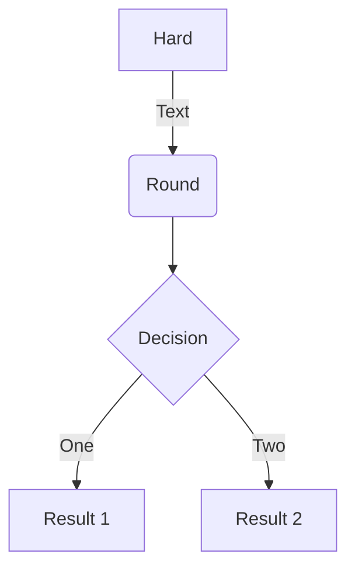

# install

[toc]

## 检查

```shell
uname -a  // 查看内核版本
ls -l /sys/class/misc/device-mapper  // 查看存储驱动
```

## 换源

略

## 安装

```shell
sudo apt-get update  // 更新源
sudo apt-get install -y docker.io  // 安装
docker version  // 查看版本，检查是否安装成功
```

## 启动

```shell
systemctl start docker  // 启动
systemctl enable docker  // 设置开机启动
```

<details><summary>try</summary>

a fig


another fig


other thing

<br>

$f(x) = a x + b$


$$\begin{align} x &= a +b+c+d\\ &= e +f\\ &= g \end{align}$$



</details>

## curl

```shell
whereis curl  // 查看是否安装 curl
apt install curl  // 安装 curl
```

## hello-world

```shell
docker run hello-world
```
