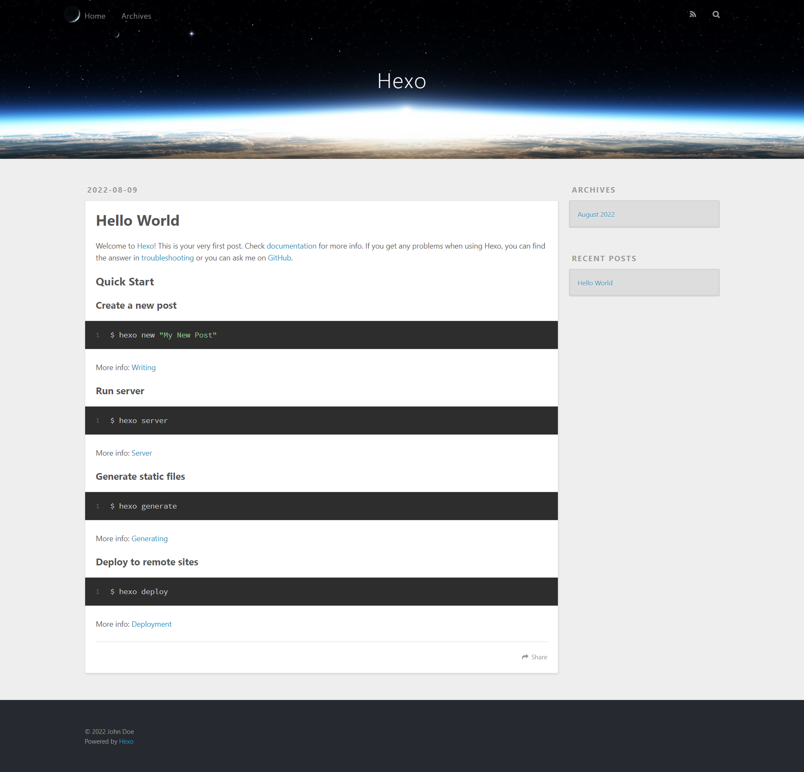
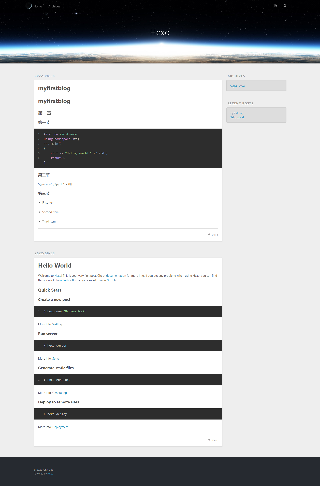

# 使用Hexo框架搭建个人静态博客

[toc]

本文使用 Hexo + Github 搭建个人静态博客网站，优点：免费、简单（相较于其他搭建个人博客网站方法），缺点：配置有点繁琐、国内访问速度不快。

**系统**：Windows10（如无特别说明，本文均在命令行，即 cmd 或者 powershell 下运行命令）

**其他说明**：

1. 由于 Windows 每个人的用户名不同，这里使用 Linux 中当前用户目录 `~` 表示 Windows 的当前用户目录。
2. 本文主要侧重于记录增加功能部分的实现，所以安装部分和一些基础内容不会赘述。
3. 在本文 [二、配置](#二、配置) 部分，有两个目录 (`blog` 和 `blog/themes/matery`) 有 `_config.yml` 文件，注意看清楚是那个目录，不要搞错了！

## 一、安装

安装视频教程可以参考：[手把手教你从0开始搭建自己的个人博客 |无坑版视频教程| hexo](https://www.bilibili.com/video/BV1Yb411a7ty?spm_id_from=333.337&vd_source=e0a4abf3a261891c5444e0f0044a7cf3)

### 1.1 搭建环境

搭建环境：需要安装 `node.js` 和 `npm` (一般 `npm` 下载较慢，所以可以下载 `cnpm`)

- step1 下载 `node.js`

直接去 `node.js` 官网下载、安装即可，建议使用 `node.js 12.0`及以上版本

`node.js` 官网下载地址：[https://nodejs.org/en/download/](https://nodejs.org/en/download/)

安装完成后，`node.js` 自带 `npm`，使用以下命令查看 `node.js` 和 `npm` 的信息：

```shell
node -v  # 查看 node 版本
npm -v  # 查看 npm 版本

# 其他命令
npm config ls -l  # 查看 npm 配置
npm info xxxx  # 查看 npm 下载的 xxxx 库的信息，比如：npm info underscore
```

- step2 下载 `cnpm` (可选)

(建议不选：因为使用 `cnpm` 安装可能会有各种很奇怪的bug，虽然 `npm` 下载慢，但是可以通过设置国内镜像的方式解决)

使用 `npm` 下载 `cnpm` 并查看 `cnpm` 信息：

```shell
npm install -g cnpm --registry=https://registry.npm.taobao.org  # 指定淘宝镜像安装 cnpm
cnpm -v  # 查看 cnpm 版本
```

- step3 解决下载慢的问题(可选，如果能忍受下载慢可以不选:smile:)

```shell
# 方法一：npm 临时设置镜像
npm --registry install xxxx https://registry.npm.taobao.org  # 其中 xxxx 是需要下载的东西

# 方法二：npm 永久设置镜像
npm config set registry https://registry.npm.taobao.org  # 建议不要再使用这个镜像，原因后说
npm config set registry https://registry.npmmirror.com  # 建议使用这个镜像，原因后说
npm config get registry  # 验证设置是否成功
npm install xxxx  # 其中 xxxx 是需要下载的东西

# 方法三：使用 cnpm (可选)
cnpm install xxxx  # 其中 xxxx 是需要下载的东西
```

镜像网站：[npmmirror 中国镜像站](https://npmmirror.com/)

> 建议不再使用 [https://registry.npm.taobao.org](https://registry.npm.taobao.org) 的原因：原淘宝 `npm`，即 `cnpm` 域名已经停止解析
>
> [http://npm.taobao.org](https://link.zhihu.com/?target=http%3A//npm.taobao.org) 和 [http://registry.npm.taobao.org](https://link.zhihu.com/?target=http%3A//registry.npm.taobao.org) 已经在 2022.06.30 号正式下线和停止 DNS 解析，域名切换规则如下：
>
> - [http://npm.taobao.org](https://link.zhihu.com/?target=http%3A//npm.taobao.org) $\Rightarrow$ [http://npmmirror.com](https://link.zhihu.com/?target=http%3A//npmmirror.com)
> - [http://registry.npm.taobao.org](https://link.zhihu.com/?target=http%3A//registry.npm.taobao.org) $\Rightarrow$ [http://registry.npmmirror.com](https://link.zhihu.com/?target=http%3A//registry.npmmirror.com)

- step4 安装 `hexo`

```shell
npm install -g hexo-cli  # 下载 hexo
hexo -v  # 查看 hexo 版本
```

到此，必要的环境已经搭建完成，关于 `node.js` 和 `npm` 等的其他内容可自行展开查看。

<details><summary>其他内容：展开说说</summary>

- 关于 `node.js`

`node.js` 是一个基于 `Chrome V8` 引擎的 `JavaScript` 运行环境。

- 关于 `npm`

`npm` 是随同 `node.js` 一起安装的包管理工具。

`npm` 的包分为全局安装(`global`)与本地安装 (`local`)，命令：

```shell
npm install express     # 本地安装
npm install express -g  # 全局安装

# 如果出现错误：npm err! Error: connect ECONNREFUSED 127.0.0.1:8087 
# 使用以下命令即可：
npm config set proxy null
```

- 关于 `cnpm`

`cnpm` 是一个完整 `npmjs.org` 镜像，你可以用此代替官方版本(只读)，同步频率目前为 **10分钟** 一次以保证尽量与官方服务同步。简单来说，`cnpm` 就是是淘宝 `npm`。

`cnpm` bug 之一：命令没反应
解决方法：卸载重装

```shell
# 卸载：
npm uninstall -g cnpm --registry=https://registry.npm.taobao.org
# 注册：
npm set registry https://registry.npm.taobao.org
# 解析：
npm set disturl https://npm.taobao.org/dist
# 安装：
npm install -g cnpm --registry=https://registry.npm.taobao.org
```

- 关于 `underscore`

`Underscore` (安装：`npm install underscore`)是目前为止 `npm` 上最流行的 `JavaScript` 库，是有最大数量 dependent 的库。

- 关于 `hexo`

`hexo` 是一个快速、简洁且高效的博客框架。

`hexo` 常用命令：

```shell
# 命令全称
hexo new page "名称"  	# 新建分页
hexo new "名称"			# 新建文章
hexo new draft "名称"		# 新建草稿
hexo publish "名称"		# 草稿生成文章
hexo publish page "名称"  # 草稿生成分页
hexo clean  			# 清除已生成文件
hexo generate			# 生成静态文件
hexo server				# 运行本地服务器（预览）
hexo server --drafts	# 运行本地服务器（预览草稿）
hexo deploy				# 部署到服务器

# 命令缩写
hexo n page "名称"  	# 新建分页
hexo n "名称"			# 新建文章
hexo n draft "名称"	# 新建草稿
hexo p "名称"			# 草稿生成文章
hexo p page "名称"  	# 草稿生成分页
hexo clean  	 # 清除已生成文件
hexo g			 # 生成静态文件
hexo s			 # 运行本地服务器（预览）
hexo s --drafts	 # 运行本地服务器（预览草稿）
hexo d			 # 部署到服务器

# 快速本地发布命令
hexo clean && hexo g && hexo s
```

</details>

### 1.2 本地发布

本地发布的网站只能在本地访问。

- step1 初始化

在本地任意目录(建议在用户目录，即 `~​`)创建一个名为 `blog` 的文件夹，进入 `blog` 文件夹，然后在**该目录** `~/blog` 下打开命令行，输入以下命令进行初始化：

```shell
hexo init
```

> 注：`hexo` 的所有命令均在 `~/blog` 目录下输入并运行！

- step2 启动博客网站

此时，本地博客网站就已经创建好了，输入以下命令启动网站：

```shell
hexo s
```

然后在浏览器地址栏输入 `localhost:4000` 访问本地发布的博客网站。如果页面加载不出来，可能是端口被占用了。Ctrl+C 关闭服务器，运行 `hexo server -p 5000` 更改端口号后重试。



- step3 写一篇文章

先新建一篇文章：

```shell
hexo n "myfirstblog"  # 新建文章
```

然后到 `blog/source/_posts` 目录下就可以看到一个 `myfirstblog.md` 文件，编辑该文件，文件里面的内容就会显示在博客网站里面。

使用任意编辑器(推荐 typora)编辑该文件，以下面内容为例：

```markdown
---
title: myfirstblog
date: 2022-02-2 22:22:22
tags:
---

# myfirstblog

## 第一章

### 第一节

​```c++
#include <iostream>
using namespace std;
int main()
{
    cout << "Hello, world!" << endl;
    return 0;
}
​```

### 第二节

${\large e^{i \pi} + 1 = 0}$


### 第三节

- First item

- Second item

- Third item

```

编辑完成、保存。

- step3 查看刚才写的文章


输入以下命令：

```shell
hexo clean
hexo g
hexo s
```

在浏览器地址栏输入 `localhost:4000` 访问本地发布的博客网站，然后就可以看到刚刚写的文章。



到此，本地发布的必要流程已经完成，更多其他内容可自行展开查看。

<details><summary>其他内容：展开说说</summary>

- 关于 `~/blog` 目录

博客的所有东西全部都在 `blog` 里面生成。如果出了什么错，直接删除 `blog` 文件夹就行了。**但是**！千万不能只删除 `blog` 文件夹里面的内容，而不删除 `blog` 文件夹，否则会出现其他问题。

- 关于新建文章内容

新建文章是使用 `markdown` 进行编辑的，`markdown` 语法不赘述，这里说说 `hexo` 新建的 `.md` 文件的文档头：

```markdown
---
title: myfirstblog
date: 2022-02-2 22:22:22
tags:
---	
```

首先，这个文档头的模板是可以修改的，具体修改方法自行百度或者见本文的**二、增加功能**部分

其次，这个文档头的的配置、说明可以自行百度或者见本文的**二、增加功能**部分

- 关于 hexo 博客主要目录结构

```shell
.
├── public		  # 网站文件夹
├── scaffolds	  # 模板文件夹
├── source		  # 用户资源文件夹 (markdown 文档)
|   ├── _draft    # 草稿文件夹
|   └── _posts    # 文章文件夹
├── themes		  # 主题文件夹
├── _config.yml	  # 网站配置信息
└── package.json  # 应用程序信息
```

</details>

### 1.3 远端发布

远端发布就是把本地发布的网站放到互联网上，让所有人都可以访问。

- step1 GitHub相关内容

这个可以自行百度或者B站，本文这部分内容日后将会完善。

不要忘了在 `git` 下面敲以下命令：（设置 `git` 的用户名和邮件，就是让 `git` 找到你的 GitHub 账户）

```text
git config --global user.name "GitHub 用户名"
git config --global user.email "GitHub 邮箱"
```

- step2 下载 `git`

自行百度下载安装即可，本文这部分内容日后将会完善。

- step3 **下载 `git` 用于上传、部署的插件，并配置相关内容**

下载：

```shell
npm install --save hexo-deployer-git
```

打开 `~/blog` 目录下的 `_config.yml` 文件，拉到最下面，找到以下相关内容：

```text
deploy:
  type: git
  repository: https://github.com/xxxx/xxxx.github.io.git
  branch: master
```

其中 `xxxx` 是你的 GitHub 用户名。保存。

- step4 将静态个人博客发布到远端 GitHub

```shell
hexo clean
hexo g
hexo d
```

- step5 查看 GitHub 仓库，访问博客网页

进入个人 GitHub 仓库即可看到新增了很多文件。在浏览器地址栏输入 `http://xxxx.github.io/` 访问远端发布的博客网站。

至此，远端发布的必要流程已经完成，更多其他内容可自行展开查看。

<details><summary>其他内容：展开说说</summary>

- 关于 **GitHub Pages**

GitHub Pages 是由 GitHub 官方提供的一种免费的静态站点托管服务，让我们可以在 GitHub 仓库里托管和发布自己的静态网站页面。我们搭建的个人博客就是使用了 GitHub Pages。如果是 Gitee，需要手动开启 Pages，GitHub 则默认自动开启。

- 使用自己的域名搭建博客

略，日后完善。

</details>

## 二、配置

<font color='orangered'>配置部分强烈建议参考官方文章：</font>[Hexo博客主题之hexo-theme-matery的介绍](https://blinkfox.github.io/2018/09/28/qian-duan/hexo-bo-ke-zhu-ti-zhi-hexo-theme-matery-de-jie-shao/)

### 2.1 修改主题

`hexo` 主题：[https://hexo.io/themes/](https://hexo.io/themes/)

这里以 matery 主题为例：

- step1 下载

在 hexo 主题目录 `~/blog/themes` 下使用 `git` 克隆 matery 主题：（或者去 GitHub 下载安装包并解压到 `~/blog/themes` 也行）

```bash
git clone https://github.com/blinkfox/hexo-theme-matery.git
```

- step2 更换主题

修改 hexo 根目录下的 `_config.yml` 的 `theme` 的值：（如果主题文件夹名称是 `hexo-theme-matery` 主题值就是 `hexo-theme-matery`，如果是 `matery` 主题值就是 `matery`）

```shell
# theme: landscape  # _config.yml 原始主题
theme: hexo-theme-matery  # matery 主题
```

- step3 `_config.yml` 文件

`_config.yml` 文件的其他修改配置见 [2.3 `_config.yml` 文件配置](#2.3 456)

### 2.2 新建博客网页内容

需要新建的博客网页有：分类页、标签页、关于页、友链页 (可选)、归档页 (可选)。

|  网页  |    英文    |                  作用                  |
| :----: | :--------: | :------------------------------------: |
| 分类页 | categories |         用来展示所有分类的页面         |
| 标签页 |    tags    |         用来展示所有标签的页面         |
| 关于页 |   about    | 用来展示**关于我和我的博客**信息的页面 |
| 友链页 |  friends   |     用来展示**友情连接**信息的页面     |
| 归档页 |            |                                        |

以分类 categories 页为例：

如果在 `blog/source` 目录下没有 `blog/source/categories/index.md` 文件，则新建一个：

```shell
hexo new page "categories"
```

然后，编辑新建的页面文件`blog/source/categories/index.md`，至少需要以下内容：

```yaml
---
title: categories
date: 2018-09-30 17:25:30
type: "categories"
layout: "categories"
---
```

### 2.3 文档头 Front-matter 选项

`Front-matter` 选项中的所有内容均为**非必填**的，但是建议至少填写 `title` 和 `date` 的值。

个人建议：为了方便阅读，`toc` 和 `summary` 建议设置；为了分类管理方便，`categories` 和 `tags` 建议设置；对于 `latex` 重度使用患者，`mathjax` 也建议设置。

| 配置选项       | 默认值                         | 描述                                                         |
| :------------- | :----------------------------- | :----------------------------------------------------------- |
| title          | `Markdown` 的文件标题          | 文章标题，强烈建议填写此选项                                 |
| date           | 文件创建时的日期时间           | 发布时间，强烈建议填写此选项，且最好保证全局唯一             |
| author         | 根 `_config.yml` 中的 `author` | 文章作者                                                     |
| img            | `featureImages` 中的某个值     | 文章特征图，推荐使用图床(腾讯云、七牛云、又拍云等)来做图片的路径.如: `http://xxx.com/xxx.jpg` |
| top            | `true`                         | 推荐文章（文章是否置顶），如果 `top` 值为 `true`，则会作为首页推荐文章 |
| cover          | `false`                        | `v1.0.2`版本新增，表示该文章是否需要加入到首页轮播封面中     |
| coverImg       | 无                             | `v1.0.2`版本新增，表示该文章在首页轮播封面需要显示的图片路径，如果没有，则默认使用文章的特色图片 |
| password       | 无                             | 文章阅读密码，如果要对文章设置阅读验证密码的话，就可以设置 `password` 的值，该值必须是用 `SHA256` 加密后的密码，防止被他人识破。前提是在主题的 `config.yml` 中激活了 `verifyPassword` 选项 |
| **toc**        | `true`                         | 是否开启 TOC，可以针对某篇文章单独关闭 TOC 的功能。前提是在主题的 `config.yml` 中激活了 `toc` 选项 |
| **mathjax**    | `false`                        | 是否开启数学公式支持 ，本文章是否开启 `mathjax`，且需要在主题的 `_config.yml` 文件中也需要开启才行 |
| **summary**    | 无                             | 文章摘要，自定义的文章摘要内容，如果这个属性有值，文章卡片摘要就显示这段文字，否则程序会自动截取文章的部分内容作为摘要 |
| **categories** | 无                             | 文章分类，本主题的分类表示宏观上大的分类，只建议一篇文章一个分类 |
| **tags**       | 无                             | 文章标签，一篇文章可以多个标签                               |

> **注意**:
>
> 1. 如果 `img` 属性不填写的话，文章特色图会根据文章标题的 `hashcode` 的值取余，然后选取主题中对应的特色图片，从而达到让所有文章都的特色图**各有特色**。
> 2. `date` 的值尽量保证每篇文章是唯一的，因为本主题中 `Gitalk` 和 `Gitment` 识别 `id` 是通过 `date` 的值来作为唯一标识的。
> 3. 如果要对文章设置阅读验证密码的功能，不仅要在 Front-matter 中设置采用了 SHA256 加密的 password 的值，还需要在主题的 `_config.yml` 中激活了配置。有些在线的 SHA256 加密的地址，可供你使用：[开源中国在线工具](http://tool.oschina.net/encrypt?type=2)、[chahuo](http://encode.chahuo.com/)、[站长工具](http://tool.chinaz.com/tools/hash.aspx)。

- `Front-matter` 简单示例

```yaml
---
title: typora-vue-theme主题介绍
date: 2018-09-07 09:25:00
---
```

- `Front-matter` 最全示例

```yaml
---
title: typora-vue-theme主题介绍
date: 2018-09-07 09:25:00
author: 赵奇
img: /source/images/xxx.jpg
top: true
cover: true
coverImg: /images/1.jpg
password: 8d969eef6ecad3c29a3a629280e686cf0c3f5d5a86aff3ca12020c923adc6c92
toc: false
mathjax: false
summary: 这是你自定义的文章摘要内容，如果这个属性有值，文章卡片摘要就显示这段文字，否则程序会自动截取文章的部分内容作为摘要
categories: Markdown
tags:
  - Typora
  - Markdown
---
```

### 2.3 文档头 Front-matter 模板

每次新建文章都要输入配置选项 Front-matter，太麻烦，这时候可以通过修改默认文章模板，这样每次新建文章时就会自动写入默认模板，很方便。

打开 `~\blog\scaffolds` 目录，发现以下文件：

```shell
scaffolds
├── draft.md  # 草稿模板
├── page.md   # 网页模板
└── post.md   # 文章模板
```

对于文章，我们只需要修改 `post.md` 即可（草稿模板和网页模板同理），修改后的内容如下：

```yaml
---
title: {{ title }}
date: {{ date }}
author: hhhhmdzz
language: zh-Hans
timezone: Asia/Shanghai
img: 
top: false
cover: false
coverImg: 
password: 
toc: true
mathjax: true
comments: true
summary: 
description: 
keyworks: 
categories: to be categoried
tags: 
  - to be tagged
---
```

### 2.4 代码高亮、代码折叠

Hexo 自带的代码高亮主题显示不好看，原本的代码显示行号和内容分开了，不美观。

所以主题中使用到了 [hexo-prism-plugin](https://github.com/ele828/hexo-prism-plugin) 的 Hexo 插件来做代码高亮，安装命令如下：

```shell
npm i -S hexo-prism-plugin
```

然后，修改 Hexo **根目录**下 `_config.yml` 文件中 `highlight.enable` 的值为 `false`，并新增 `prism` 插件相关的配置，主要配置如下：

```yaml
highlight:				# 代码块的设置
  enable: false			# 开启代码块高亮
  line_number: true		# 如果未指定语言，则启用自动检测
  auto_detect: false	# 显示行数
  tab_replace: ''		# 用n个空格替换tabs；如果值为空，则不会替换tabs
  wrap: true
  hljs: false

# 关闭原有的代码高亮，使用自己的
prism_plugin:
  mode: 'preprocess'    # realtime/preprocess
  theme: 'tomorrow'
  line_number: false    # default false
  custom_css:
```

### 2.5 搜索

本主题中还使用到了 [hexo-generator-search](https://github.com/wzpan/hexo-generator-search) 的 Hexo 插件来做内容搜索，安装命令如下：

```bash
npm install hexo-generator-search --save
```

在 Hexo **根目录**下的 `_config.yml` 文件中，新增以下的配置项：

```yaml
search:
  path: search.xml
  field: post
```

### 2.6 中文链接转拼音（可选）

如果你的文章名称是中文的，那么 Hexo 默认生成的永久链接也会有中文，这样不利于 `SEO` (Search Engine Optimization，搜索引擎优化)，且 `gitment` 评论对中文链接也不支持。我们可以用 [hexo-permalink-pinyin](https://github.com/viko16/hexo-permalink-pinyin) Hexo 插件使在生成文章时生成中文拼音的永久链接。

安装命令如下：

```bash
npm i hexo-permalink-pinyin --save
```

在 Hexo **根目录**下的 `_config.yml` 文件中，新增以下的配置项：

```yaml
permalink_pinyin:
  enable: true
  separator: '-' # default: '-'
```

> **注**：除了此插件外，[hexo-abbrlink](https://github.com/rozbo/hexo-abbrlink) 插件也可以生成非中文的链接。

### 2.7 文章字数、阅读时长统计插件（可选）

如果你想要在文章中显示文章字数、阅读时长信息，可以安装 [hexo-wordcount](https://github.com/willin/hexo-wordcount)插件。

安装命令如下：

```bash
npm i --save hexo-wordcount
```

然后只需在**本主题**下的 `_config.yml` 文件中，激活以下配置项即可：

```yaml
wordCount:
  enable: false # 将这个值设置为 true 即可.
  postWordCount: true
  min2read: true
  totalCount: true
```

### 2.8 添加 RSS 订阅支持（可选的）

本主题中还使用到了 [hexo-generator-feed](https://github.com/hexojs/hexo-generator-feed) 的 Hexo 插件来做 `RSS`，安装命令如下：

```bash
npm install hexo-generator-feed --save
```

在 Hexo **根目录**下的 `_config.yml` 文件中，新增以下的配置项：

```yaml
feed:
  type: atom
  path: atom.xml
  limit: 20
  hub:
  content:
  content_limit: 140
  content_limit_delim: ' '
  order_by: -date
```

执行 `hexo clean && hexo g` 重新生成博客文件，然后在 `public` 文件夹中即可看到 `atom.xml` 文件，说明你已经安装成功了。

### 2.9 配置音乐播放器（可选的）

### 2.10 修改社交链接

### 2.11 修改页脚

页脚信息可能需要做定制化修改，而且它不便于做成配置信息，所以可能需要你自己去再修改和加工。修改的地方在**主题文件**的 `/layout/_partial/footer.ejs` 文件中，包括站点、使用的主题、访问量等。

### 2.12 修改打赏的二维码图片

在主题文件的 `source/medias/reward` 文件中，你可以替换成你的的微信和支付宝的打赏二维码图片。

### 2.13 添加 emoji 表情支持

安装插件 `hexo-filter-github-emojis`

```shell
npm install hexo-filter-github-emojis --save
```

在 Hexo **根目录**下的 `_config.yml` 文件中，新增以下的配置项：

```yaml
githubEmojis:
  enable: true
  className: github-emoji
  inject: true
  styles:
  customEmojis:
```

### 2.14 添加 mermaid 支持

```shell
npm install hexo-tag-mermaid --save
```

修改主题目录下的 `_config.yml` 文件：

```yaml
mermaid: ## mermaid url https://github.com/knsv/mermaid
  enable: true  # default false
  version: "latest" # default v7.1.2
  options:  # find more api options from https://github.com/knsv/mermaid/blob/master/src/mermaidAPI.js
    #startOnload: true  // default true
```

### 2.15 添加导航页

[为你的 hexo 博客添加导航页](https://yafine-blog.cn/posts/e925.html)

### 2.16 动态网页标题

### 2.17 直达评论

[增加点击跳转评论按钮](https://blog.csdn.net/cungudafa/article/details/106278206)

### 2.18 添加思维导图支持

```shell
npm install hexo-simple-mindmap
```

使用：（注意，这个不需要使用代码块，另外，typora不支持思维导图）

```markdown


- [在 Hexo 中使用思维导图](https://hunterx.xyz/use-mindmap-in-hexo.html)
  - 前言
  - 操作指南
    - 准备需要的文件
    - 为主题添加 CSS/JS 文件
  - 使用方法


```


## 三、问题

### `=====             Context Dump Ends            =====`


原因：文章中出现连续的花括号，如：`{{}}`

具体原因：hexo 的文章使用 `Nunjucks` 渲染，`Nunjucks` 的花括号 `{}` 有不同的语法，但是如果使用了 `mathjax` 渲染的 latex 公式，容易出现花括号重叠 `{{}}`，这样二者就冲突了。

解决办法：以 $e^{x^{2}}$ 即 `$e^{x^{2}}$` 为例

1. 使用空格隔开花括号：`$e^{x^{2} }$` (个人认为最好用)
2. 使用 `\` 转义：`$e^{x^{2\} \}$` (有用，但是某些情况不适用)
3. 修改标识符：` $e^{x^{2} }$ ` (较麻烦，而且不通用)

- 图片不显示

下载 `hexo-asset-image` 插件 (科学上网会快一点)

```shell
npm install https://github.com/CodeFalling/hexo-asset-image --save
```

修改根目录 `_config.yml` 文件内容：

```yaml
post_asset_folder: true
```

## 注意

### 关于 LaTeX

不能连续使用 `~`
不能使用 `\textcolor{xxx}`

## 参考

- 一、安装：
    - 1.1 搭建环境
        - [设置npm的registry](https://www.cnblogs.com/sghy/p/6840925.html)
    - 1.2 创建GitHub仓库
    - 1.3 安装Hexo
    - 1.4 发布网站
- 二、增加功能
    - 官方：[Hexo博客主题之hexo-theme-matery的介绍](http://blinkfox.com/2018/09/28/qian-duan/hexo-bo-ke-zhu-ti-zhi-hexo-theme-matery-de-jie-shao/)
    - 2.4 代码高亮、代码折叠
        - [代码块优化](http://www.luckyzmj.cn/posts/1b9a9e28.html)

- 几个不错的教程：
  - 个人感觉较好：[Matery主题搭建与优化教程超详细解析](Matery主题搭建与优化教程超详细解析)
  - 这个系列好：[https://zhangxiaocai.cn/categories/Hexo/](https://zhangxiaocai.cn/categories/Hexo/)
