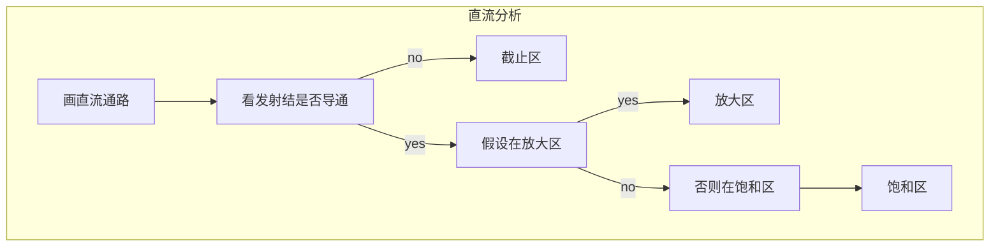

# 第1章-半导体基础元件于非线性电路

[toc]

$大_{大} V_D：直流量，常数（手册有）$

$小_{小} i_d：交流量$

$大_{小} V_{im}：交流有效值 幅值$

$小_{大}：交流直流之和的瞬时总量，（既有直流又有交流）$

## 1.1 本征半导体

半导体：导电能力介于导体和绝缘体之间的一种物质。（常见半导体材料：硅晶体、锗晶体、砷化镓化合物等）

一个硅原子会与四个相邻的硅原子形成共价键结构。

本征半导体：纯净的、不含杂质(纯度$99.9999999\%$)的半导体

共价键的束缚力很强，当热力学温度为零度，而且没有其他外界能量激发的时候，价电子全部会束缚在共价键中，晶格中没有自由移动的载流子，所以此时的半导体不导电，相当于绝缘体。

**本征激发**：当温度升高/光照加强时，会产生自由电子空穴对这种现象。

自由电子（热激发产生）和空穴（价电子挣脱束缚后留下的空位）是成对出现的，称为自由电子空穴对。

自由电子带负电荷，可自由移动；空穴带与电子等量的正电荷，也可移动。

空穴的移动反映了价电子的移动，价电子移动方向与空穴移动反向相反。即，空穴能自由移动而参与导电。这样，可以用空穴移动产生的电流代表价电子移动产生的电流。**可以把空穴看成一种可移动的带电粒子。**

载流子：参与导电的粒子。半导体中有两种载流子：自由电子和空穴。

复合：自由电子和空穴相遇而同时消失。外部条件不变时，载流子的产生和复合处于动态平衡之中。

---

## 1.2 杂质半导体

半导体中的热敏性、光敏性、参杂性

热敏性：温度升高，导电能力显著提高
光敏性：光照加强，导电能力显著变化
参杂性：本征半导体加入杂质，导电能力显著提高

本征半导体 --加杂质元素--> 杂质半导体

掺入少量杂质元素产生的空穴/自由电子数目远大于本征激发产生的载流子数目

添加的杂质主要是三价/五价元素：硼 B、磷 P 等

- P型半导体（+3价杂质，如 B）

三价杂质接收电子 -> 受主杂质

杂质元素 --常温电离--> $\begin{cases}空穴（可以自由移动，参与导电）\\负离子（不能自由移动，不参与导电）\end{cases}$

P型半导体（空穴半导体）$\begin{cases}多子——空穴（产生：杂质电离(主要) + 本征激发）\\少子——自由电子（产生：本征激发）\end{cases}$

P半导体简化模型表示：

- N型半导体（+5价杂质，如 P）

五价杂质接收电子 -> 施主杂质

杂质元素 --常温电离--> $\begin{cases}自由电子（可以自由移动，参与导电）\\正离子（不能自由移动，不参与导电）\end{cases}$

N型半导体（电子半导体）$\begin{cases}多子——自由电子（产生：杂质电离(主要) + 本征激发）\\少子——空穴（产生：本征激发）\end{cases}$

N半导体简化模型表示：

杂质半导体呈电中性$\begin{cases}多子浓度主要取决于参杂浓度\\少子浓度取决于本征激发\end{cases}$

---

## 1.3 PN结及其单向导电性

- PN结**正偏**特性：**正向导通**

呈小电阻特性，理想情况下相当于开关闭合，处于导通状态。

外电场与内电场方向相反，内建电场减弱 -> 多子扩散 -> 多子向PN结移动，中和部分离子 -> 阻挡层(耗尽层)变窄 -> 多子扩散形成扩散电流 -> PN结导通

电压 $V_D$ 略微升高，电流 $i_D$ 显著升高

导通电压：$V_{D(on)} \approx \begin{cases}0.7V & (Si)\\ 0.2V & (Ge)\end{cases}$

- PN结**反偏**特性：**反向截止**

呈大电阻特性，理想情况下相当于开关断开，处于截止状态。

外电场与内电场方向相同，内建电场增强 -> 少子漂移 -> 多子背离PN结移动，中和部分离子 -> 阻挡层变宽 -> 少子漂移形成扩散电流 -> PN结截止

- PN结单向导电的**伏安特性**

---

## 1.4 二极管简介

常见封装形式的二极管：有特殊色环/色带对应的电极是阴极

- 二极管的特性

伏安特性方程：${\large i_D \approx I_S (e^{\frac{\nu_{D}}{V_{T}}} - 1)}$
此方程只描述单向导电特性、温度特性和电容特性。

开启电压/门坎电压(二极管$\approx$0.5V，Si 0.7V，Ge 0.2V)：只有正偏电压超过一定电流值时，电流才明显增加。

- 硅二极管的伏安特性曲线：**正向特性、反向特性、反向击穿特性**

二极管的正向压降近似等于导通电压，反向电流近似为反向饱和电流

---

## 1.5 二极管简化模型

工程上，使用二极管的简化模型代替其指数模型——使用分段线性

- 二极管的几种**简化模型**
  - 直折线模型
  - 恒压降模型
  - 理想模型
  - 小信号模型（前三种都是打信号模型）

- 大信号模型建模思路：使用分段线性方法，把二极管非线性关系近似表示为几段线性关系。
  - 大电压大电流工作的等效模型
  - 只反映二极管的单向导通型
  - 关键判断二极管是导通还是截止

- 小信号模型
  - 高频工作时，还需考虑二极管的结电容特性

工程上，使用**简化模型**分析、设计二极管电路，但是最终工程实现和电路优化时，使用**复杂模型**进行精度误差分析。

>根据二极管的伏安特性曲线和方程：二极管的动态电阻 $r_d$ 随着加在其两端的电压增大而增大。

---

## 1.6 二极管应用电路之整流电路

若电路中有多个二极管，正偏电压最大的二极管优先导通

- 判断二极管导通/截止

理想二极管：$V_D > 0$ 导通，反之截止
实际二极管：$V_D > V_{D(on)}$ 导通，反之截止

当电路中有多个二极管时，**正偏电压最大**的管子优先导通，其余管子需要**重新分析其工作状态**。

- **半波整流电路**

使用二极管的理想模型分析电路

- **桥式整流电路**

使用二极管的理想模型分析电路

---

## 1.7 二极管应用之限幅电路及开关电路

- **限幅电路**

- **开关电路**

设：二极管的导通电压为$V_{D(on)}=0.7V$

---

## 1.8 二极管的小信号应用

- **等效电路法**

- **图解分析法**

---

## 1.9 稳压二极管

稳压二极管由特殊工艺制作的二极管，可以在反向击穿状态下工作。（稳压管正常工作都处于反向击穿状态）

**击穿电压** $V_{BR}$：反向击穿所需要的电压称为击穿电压（击穿原因：破坏原子中共价键的束缚，使自由电子空穴对数目急剧增加造成）

${击穿} = \begin{cases}{热击穿}_{（不可逆，必须避免）}：{PN 结烧毁}\textcolor{red}{i_D\cdot v_D > P_M}\\ {电击穿}_{（可逆，可以利用）}：{PN 结未破坏}_{（断点/降压恢复）}\textcolor{red}{i_D\cdot v_D < P_M}\end{cases}$，$P_M$ 为 $PN$ 结耗散功率

若反向电流小于 $I_{Zmin}$，稳压管就会回到**截止状态**，即无法稳压；
若反向电流大于 $I_{Zmax}$，稳压管可能被**热击穿**。

稳压管正常工作时，处于反向击穿状态，所以，电路中电压电流的参考方向与普通二极管相反，即反向击穿电压和反向电流都标注为正值。

---

## 1.10 双极结型三极管结构

$BJT$

箭头标注在发射极上，表示发射结正偏时电流的实际方向，由 $P \to N$

基区薄，减少基区复合概率，保证发射区载流子能扩散到集电结边界。

---

## 1.11 双极结型三极管导电原理

- 三极管工作状态 & 外部条件：
  - 放大模式：发射结正偏，集电结反偏
  - 饱和模式：发射结正偏，集电结正偏
  - 截止模式：发射结反偏，集电结反偏
     
- 放大模式（放大电流）
   
  - ${\large \alpha = \frac{收集电流}{发射电流} = \frac{i_{Cn}}{i_{En}}}$
     
  - ${\large \beta = \frac{收集电流}{复合电流} = \frac{i_{Cn}}{i_{En} - i_{Cn}} = \frac{i_{Cn}}{i_{Bn}}}$
     
  - $\textcolor{red}{I_C \approx \beta I_B} \approx \alpha I_E ,~ I_E \approx (1 + \beta)I_B$
     

- 三极管的正向受控作用

NPN，发射极电压最低

PNP，发射极电压最高

- 举个例子：( From [三极管类型及工作状态判断](https://blog.csdn.net/qq_40924641/article/details/110233536) )

- $(a) ~ \because V_{BE} = 0.7V, V_C = 5V ,~ \therefore V_E = 0V, V_B = 0.7V ,~ NPN硅管$
- $(b) ~ \because V_{BE} = 0.3V, V_C = -10V ,~ \therefore V_E = -5V, V_B = -5.3V ,~ PNP锗管$

---

## 1.12 三极管伏安特性曲线

集电极不能做输入；基极不能做输出。

- 共发射极

输入特性：$i_B = f(v_{_{BE}})|_{v_{CE} = _{常数}}$

输出特性：$i_C = f(v_{_{CE}})|_{i_{B} = _{常数}}$

- 三极管的输入特性曲线

$V_{CE} < 1V$ 说明工作在饱和区

$V_{CE} \ge 1V$ 说明工作在放大区，$V_{BE}$ 为**发射结导通电压**

基区宽度调制效应：NPN：

$V_{CE} = V_{CB} + V_{BE}$，$V_{BE}$ 几乎不变，$V_{CE}$ 增大，$V_{CB}$增大，

CE 结电压变大（从发射极到集电极的引力越大，速率越快），

BC 结变宽，基区变窄（多子/自由电子很快到集电极，发射极的电子发射能力不行，电子供给不够，导致基极电子少了，电流小）。

$V_{CE}$ 越大，$V_{BE}$ 也要跟着变大，电流才能一致，或者在 $i_E$ 处增加一个电流源，使其电流恒定。

放大的本质：自由电子从发射极到集电极。$V_{BE} $不变，发射极发射的电子不变，$i_E$ 不变，$V_{CE}$增大，$i_C$增大，$i_B$自然就减小了，$i_{E} = i_{C} + i_{B}$

- 三极管的输出特性曲线

输出特性曲线：饱和区、放大区、截止区、击穿区

- **三极管模型**

- 三极管的线性等效：直折线

- 饱和区直流电路简化模型

通常，饱和压降 $V_{CE(set)} \approx \begin{cases}0.3V & Si\\ 0.1V & Ge\end{cases}$

- 放大区直流电路简化模型

发射结导通电压 $V_{BE(on)} = \begin{cases}0.7V & Si\\ 0.2-0.3V & Ge\end{cases}$

- 截止区直流电路简化模型

- **例、静态工作点的近似计算（直折线模型）**

- 放大区
  - $\begin{cases}V_{BE} \approx V_{BE(on)}\\ I_C = \beta I_B\end{cases} \Rightarrow I_B、I_C、V_{CE}$
  - $NPN：V_{CE} > V_{CES}$，$PNP：V_{EC} > V_{ECS}$

- 饱和区
  - $\begin{cases}V_{BE} \approx V_{BE(on)}\\ V_{CE} \approx V_{CES}\end{cases}$
     
- **三极管交流放大区小信号模型**

$
{\large r_{be} = r_{bb'} + r_{b'e}}\\
{\large\quad~ \approx r_{bb'} + \frac{26(mV)}{I_{BQ}}}\\
{\large\quad~ \approx r_{bb'} + (1 + \beta)\frac{26(mV)}{I_{EQ}}}\\
{\large\quad~ \approx r_{bb'} + \beta\frac{26(mV)}{I_{CQ}}}\\
$

注意：小信号电路模型只能用来分析叠加在  $Q$ 点上各**交流**量之间的相互关系，不能分析直流参量。

---

## 1.13 场效应管的结构及电路符号

PN 结处处**反偏**，场效应管工作

多子 $S \to D$

$i_D \approx K(v_{GS} - v_{GS(off)})^2$

转移特性曲线：$i_D = I_{DO}(\frac{u_{GS}}{V_{GS(th)}} - 1)^2$

- 沟道：载流子流通的渠道、路径
  - N 沟道：以 N 型区作为路径
  - P 沟道：以 P 型区作为路径

- 结型场效应管的结构示意图及电路符号

- 绝缘栅场效应管的结构示意图及电路符号

绝缘栅场效应管：也称为 金属-氧化物-半导体型场效应管，简称为 MOS管

对 N 沟道增强型：

S 源极和 D 漏极之间要导电，需要通过栅极绝缘层下方称为沟道的区域。

一般 S 源极和 D 漏极均会和 P 型衬底之间形成 PN 结，导致 S 源极和 D 漏极无法导通。

要形成导电通道，必须在栅极加一定的电压，让沟道区域由 P 型衬底变成 N 型区

- 另外

几个区：可变电阻区、横流区、夹断区、击穿区
也叫做：非饱和区、饱和区、截止区、击穿区

控制 G 栅极的电压，可以控制 S 源极和 D 漏极的电流，即控制 S 源极和 D 漏极的电阻，所以就得到一个电压控制的可变电阻器

- 对于增强型：

$V_{GS(th)}$ 开启电压（th: threshold 阈值）

预夹断之后进入恒流区，$V_{GS}$ 可以控制 $i_D$

- 对于耗尽型：

$V_{GS(off)}$ 关断电压

---

## 1.14 场效应管的工作原理及特性曲线

漏极不能做输入；栅极不能做输出。

简单来说，就是通过控制电压 $v_{_{GS}}$ 和 $v_{_{DS}}$ 控制电流 $v_{_{D}}$，即**受电压控制的电流源**。

- **转移特性曲线**

工作在饱和区的**条件**：

| 场效应管类型 |                             条件                             |
| :----------: | :----------------------------------------------------------: |
|  N 沟道结型  | ${\large \begin{cases}v_{_{DS}} > v_{_{GS}} - v_{_{GS(off)}}\\ v_{_{GS(off)}} > v_{_{GS}} > 0\end{cases}}$ |
| N 沟道耗尽型 | ${\large \begin{cases}v_{_{DS}} > v_{_{GS}} - v_{_{GS(off)}}\\ v_{_{GS}} > v_{_{GS(off)}}\end{cases}}$ |
| N 沟道增强型 | ${\large \begin{cases}v_{_{DS}} > v_{_{GS}} - v_{_{GS(th)}}\\ v_{_{GS}} > v_{_{GS(th)}}\end{cases}}$ |

转移特性**关系**：

${\large i_D \approx K(v_{_{GS}} - v_{_{GS(X)}})^2} ,~ X = th ~ or ~ off$

- **输出特性曲线**

工作状态及其条件和特点：

|         工作状态         |                             条件                             |                        特点                        |
| :----------------------: | :----------------------------------------------------------: | :------------------------------------------------: |
| 非饱和区 (可变电阻区) | ${\large v_{_{GS}} > v_{_{GS(th)}} ~,~ v_{_{DS}} < v_{_{GS}} - v_{_{GS(th)}}}$ |      $i_d$ 受 $v_{_{GS}}$ 和 $v_{_{DS}}$ 控制      |
|    饱和区 (恒流区)    | ${\large v_{_{GS}} > v_{_{GS(th)}} ~,~ v_{_{DS}} > v_{_{GS}} - v_{_{GS(th)}}}$ | $i_d$ 受 $v_{_{GS}}$ 控制，与 $v_{_{DS}}$ 几乎无关 |
|          截止区          |             ${\large v_{_{GS}} < v_{_{GS(th)}}}$             |                     $i_d = 0$                      |
|          击穿区          |                                                              |             应尽量**避免**工作在该区域             |

- **三极管 & 场效应管**

三极管的放大区和场效应管的饱和区特点一样：

---

三极管是**双极性电流**控制型器件，场效应管是**单极性电压**控制型器件。