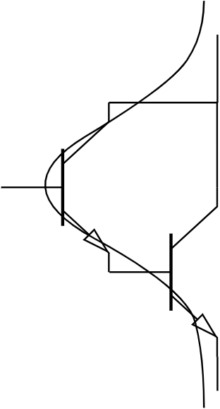

# 第2章-放大单元与基本组成电路

[toc]

## 2.1 放大的概念

放大的本质是能量放大&能量转换

耦合电路：增加电容

---

## 2.2 放大电路的直流工作平台

- 放大电路中直流电源的作用：
  1. 提供放大功率
  2. 保证放大期间具有正向受控作用

放大电路的放大是建立在直流工作平台基础上的信号放大。

---

## 2.3 直流通路和交流通路

- 直流通路：
  - 交流信号置零
  - 电容开路
  - 电感短路

- 交流通路：
  - 直流信号置零
  - 电容短路
  - 电感开路

---

## 2.4 静态工作点的稳定

---

## 2.5 放大电路的性能指标

- 性能指标
  - 增益（放大倍数）：输出与输入之比
    1. 电压增益 ${\large A_u = \frac{\dot{U_o}}{\dot{U_i}}}$
    2. 电流增益 ${\large A_i = \frac{\dot{I_o}}{\dot{I_i}}}$
    3. 互阻增益 ${\large A_r = \frac{\dot{U_o}}{\dot{I_i}}}$
    4. 互导增益 ${\large A_g = \frac{\dot{I_o}}{\dot{U_i}}}$
  - 输入阻抗：${\large Z_i = \frac{\dot{U_i}}{\dot{I_i}}}$
  - 输出阻抗：${\large Z_o = \frac{\dot{U_o}}{\dot{I_o}}|_{R_L = \infin ~,~ \dot{U}_S = 0}}$

**放大倍数、$R_i$、$R_o$**、通频带、非线性失真、最大不失真输出电压、最大输出功率与频率

---

## 2.6 晶体管的H参数等效模型

- 三极管的三种组态的微变等效模型

---

## 2.7 共发射极放大电路的动态分析

<!-- - 增益

  - 无 $R_E$：$A_u = - \frac{R_L'\beta I_b}{r_{be}I_b} = - \frac{R_L'\beta}{r_{be}}$ 增加放大增益
  - 有 $R_E$：$A_u = - \frac{R_L'\beta I_b}{r_{be}I_b + I_eR_E} = - \frac{R_L'\beta}{r_{be} + (1 + \beta)R_E}$ 稳定放大增益 -->

<b>一个具体的例子</b>：增益、输入阻抗、输出阻抗

---

## 2.8 增益稳定的共发射极放大电路动态电路分析

**(发射极)旁路电容**能提高放大增益：当无这电容时候，共发射放大电路由于发射极有电阻，这个电阻现成**负反馈**，使得放大电路的**增益降低**；当并联了旁路电容后，交流等效短路这个电阻，那么极大的**减少负反馈量**，这样可以**提高**本级的放大量，即增益。

<b>一个具体的例子</b>：增益、输入阻抗、输出阻抗

---

## 2.9 共集电极放大电路

<b>一个具体的例子</b>：增益、输入阻抗、输出阻抗

---

## 2.10 共基极放大电路

<b>一个具体的例子</b>：增益、输入阻抗、输出阻抗

---

## 2.11 晶体管基本放大电路三种接法的比较

- 三种基本放大单元电路性能

|             |                    电压增益 $A_u$                    | 电流增益 $A_i$  |       输入电阻 $R_i$       |          输出电阻 $R_o$          |
| :---------: | :--------------------------------------------------: | :-------------: | :------------------------: | :------------------------------: |
| 共发射极 CE |             $- \frac{\beta R_L}{r_{be}}$             |     $\beta$     |          $r_{be}$          |             $\infin$             |
|  共基极 CB  |              $\frac{\beta R_L}{r_{be}}$              |      $-1$       | $\frac{r_{be}}{1 + \beta}$ |             $\infin$             |
| 共集电极 CC | $- \frac{(1 + \beta) R_L}{r_{be} + (1 + \beta) R_L}$ | $- (1 + \beta)$ | $r_{be} + (1 + \beta)R_L$  | $\frac{r_{be} + R_S}{1 + \beta}$ |

**接口电路**：共集电极放大电路

---

## 派生电路

- 复合管

小功率管子($\beta$ 大)在前级，大功率管子($\beta$ 小)的后级。

- 共射-共集放大电路

- 共集-共集放大电路

## 晶体管恒流源

- **1. 镜像恒流源**

- **2. 非对称恒流源**

---

## 2.12 共源极放大电路

<b>一个具体的例子</b>：增益、输入阻抗、输出阻抗

---

## 2.13 多级放大电路

- 电路中各级基本放大电路的连接方式
  - 多级放大电路常采用两种耦合方式：
    - 间接耦合（隔直流）
      - 阻容耦合——通过电容连接
      - 变压器耦合——通过变压器连接
    - 直接耦合——不通过任何器件连接

- 各个的优缺点
  - 阻容耦合
    - 优点：各级静态工作点相互独立，互不影响
    - 缺点：①低频特性差，不利于传递缓慢变化的信号②电容体积大，不易集成
  - 变压器耦合
    - 优点：①各级静态工作点**相互独立**，互不影响②在传递交流信号的同时实现**阻抗变换**
    - 缺点：①低频特性差，不利于传递缓慢变化的信号②变压器笨重，无法集成
  - 直接耦合
    - 优点：①利用集成②低频特性好
    - 缺点：①前后静态工作点相互影响②零点漂移

- 零点漂移（可以参考：[直接耦合多级放大电路的零点漂移](http://www.jdzj.com/diangong/article/2018-2-3/96884-1.htm)）
  - 当输入信号电压为零时，输出电压发生缓慢无规则变化的现象
  - 产生的原因：**①温度变化（主要）**②直流电源波动③元件老化……
  - 解决方法：**差分放大电路**

---

## 2.14 多级放大电路性能指标分析

总电压增益等于各级电压增益之积

多级放大电路的**输入阻抗** = 第一级（输入级）的输入阻抗（但是这不意味着与后级无关）

前级的**负载阻抗**可以看作后级的**输入阻抗**。

前级的**输出阻抗**可以看作后级的**信号源内阻抗**。

多级放大电路的**输出阻抗** = 最后一级（输出级）的输出阻抗（但是这不意味着与前级无关）

---

## 2.15 对称结构单元放大电路之差分放大电路工作原理

- 温度漂移解决方案
  - 直流负反馈
  - 温度补偿
  - 寻找电路对称结构——差分放大电路

差分放大电路：静态工作点 + 小信号的放大电路

$R_L$ 两端电压相等，可视为开路。

---

## 2.16 对称结构单元放大电路之差分放大电路的信号选择性

差分放大电路对信号有**选择性**

${\large i_o = \frac{R_C}{2R_C + R_L}(i_{c2} - i_{c1})}\\
{\large u_o = \frac{R_LR_C}{2R_C + R_L}(i_{c2} - i_{c1})}$

$输入信号 = 共模信号 \pm 差模信号$

差分放大电路**抑制共模信号，放大差模信号**

---

## 2.17 对称结构单元放大电路之差分放大电路指标分析

<b>一个具体的例子</b>：增益、输入阻抗、输出阻抗

- 电路分析
  
  
  

- 双端输出
  共模信号
  
  差模信号
  
  差模信号的电压增益、输入电阻和输出电阻
  

- 单端输出
  共模信号
  
  差模信号的电压增益、输入电阻和输出电阻
  

- 共模信号和差模信号的微变等效电路及电压增益
  

差分放大器可以抑制共模信号的原因：

    1. 电路结构对称
    2. 共模抑制电阻 $R_{EE}$

共模抑制比：${\large K_{CMR} = |\frac{A_{ud}}{A_{uc}}|}$，**共模抑制比越大性能越好**。

---

## 2.18 对称结构单元放大电路之功率放大电路工作原理

功放：通常作为多级放大电路的**输出级**，主要功能：为了推动负载工作，如：使扬声器发声，继电器动作，仪表指针偏转等

- 功放**设计需求**
  - （1）在不失真前提下尽可能的输出较大功率
  - （2）具有较高的效率（前面学习的**小信号放大电路效率较低**）

- 小信号放大电路效率较低的原因
  在放大静态工作状态时会**消耗功率**，导致效率较低（**甲类工作状态**）；在截止静态工作状态时，虽然不会消耗功率而且输入交流信号的动态范围提升，但是产生了**严重的失真**，晶体管只在半个周期内处于导通状态（**乙类工作状态**）。

传统功放常采用变压器耦合方式（无法集成，影响低频性能）

**OTL**(Output Transformerless，无输出变压器)**互补对称功放**

- 晶体管的两类工作状态

- 静态工作点电压

- 两晶体管在一个周期内轮流交替导通，每个晶体管在半个周期内工作，处于**乙类工作状态**，均为共集电极放大电路

---

## 2.19 对称结构单元放大电路之OCL功率放大电路

**OTL** 电路虽然省去了输出变压器，但是输出还存在大容量电容，该电容无法**集成**，并且还影响低频性能。

电容 $C_2$ 在电路中的作用：①保证三极管 $T_2$ 导通 ②为信号放大提供能量

无法直接去掉电容，解决办法：添加一个负电源代替该电容的功能——电路采用正负双电源供电，得到——**OCL**(Ouput Capacitorless，无输出电容)**乙类互补对称功放**

---

## 2.20 对称结构单元放大电路之功率放大电路的交越失真

三极管加上一个正向电压，该电压一定要大于**开启电压**，三极管才开始导通。当信号在零附近时，两个三极管都处于截止状态，这样，信号在过零点附近就会产生失真——交越失真。

- **交越失真**

- 对OCL乙类互补对称功放做出**改进**

**OCL甲乙类互补对称功率放大电路**（工作状态介于甲类和乙类之间，更接近于乙类）

---

## 2.21 对称结构单元放大电路之功率放大电路指标分析

---

## 2.22 对称结构单元放大电路之OTL功率放大电路指标分析

OTL电路中的电容作用——做电源

因为OTL电路中 $V_B = \frac{Vcc}{2}$，所以可以看作是 OCL点路中的 $Vcc$ 换成 $\frac{Vcc}{2}$，效果一样。

---

---

射极输出器（射极跟随器）是三极管**共集电极**组成的放大器。因为输出在射极电阻 RE 两端,故名射极输出器。

共栅极放大电路称为电流接续器；
共漏极放大电路称为电压跟随器

源电压增益：${\large A_{vs} = \frac{v_o}{v_s} = \frac{v_i}{v_s} \cdot \frac{v_o}{v_i} = \frac{R_i}{R_i + R_s}A_v}$

旁路电容：提高增益

长尾电阻 -> 理想电流源：提高共模抑制比（使得单端输出具有双端输出的共模抑制比）

模电：第一级输入R大，中间级放大倍数大，最后一级输出R小

差分放大器双端输出抑制效果最好

如何理解对称：直流时，包含B、E的回路对称

长尾电阻：REE --》电流源 IEE：提高共模抑制比
